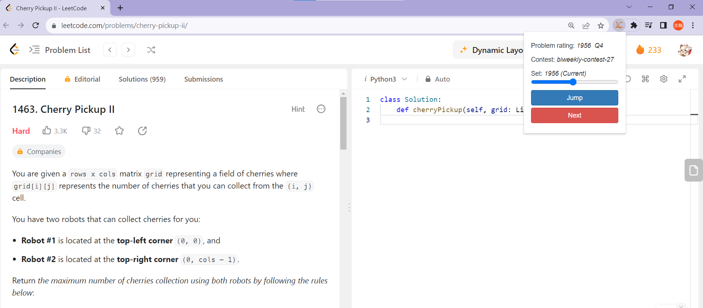
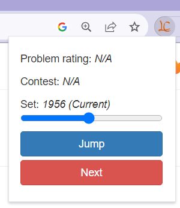

# leetcode-extension
A chrome extension to select problems within particular difficlty ratings.
# Introduction
You can use the extension popup to check the problem info and do the following:
  1. click #jump to get whatever rating the problem you prefer. 
  2. click #next to challenge the advanced problem due to the current page of problem.

The problem info whould show N/A if it does not included in ratings 
which is based on the biweekly / weekly-contest, except 1st-62nd weekly contest.

# Preview

 

# Acknowledgement
<ul>
  <li>Ratings are based on <a href="https://github.com/zerotrac/leetcode_problem_rating">https://github.com/zerotrac/leetcode_problem_rating</a></li>
  <li>Refference: <a href="https://github.com/boenshao/leetcode-difficulty-rating-extension">https://github.com/boenshao/leetcode-difficulty-rating-extension</a></li>
</ul>
